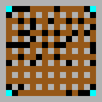
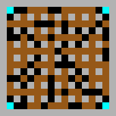

# bomberchamp

A solution to an end of lecture project in 'Fundamentals of Machine Learning'.
The original project setup can be found here: https://github.com/ukoethe/bomberman_rl

[The report.](tex/bomberchamp.pdf)

This repository implements the [Rainbow DQN](https://arxiv.org/abs/1710.02298) with the exception of the distributional part. The model implementation is done in [Keras](https://keras.io/), the update process uses [tensorflow](https://www.tensorflow.org/) directly.

The agent is then trained on the game Bomberman.

  

The minigames can be found in [simple_games.ipynb](simple_games.ipynb), the reimplementation of the Bomberman environment in [simple.py](simple.py).

## Training

The agent can be trained using the jupyter notebook [train.ipynb](train.ipynb). The training agent is in [agent_code/tensor_agent](agent_code/tensor_agent)

## Final agent

The final agent can be found in [agent_code/bomberchamp](agent_code/bomberchamp).
